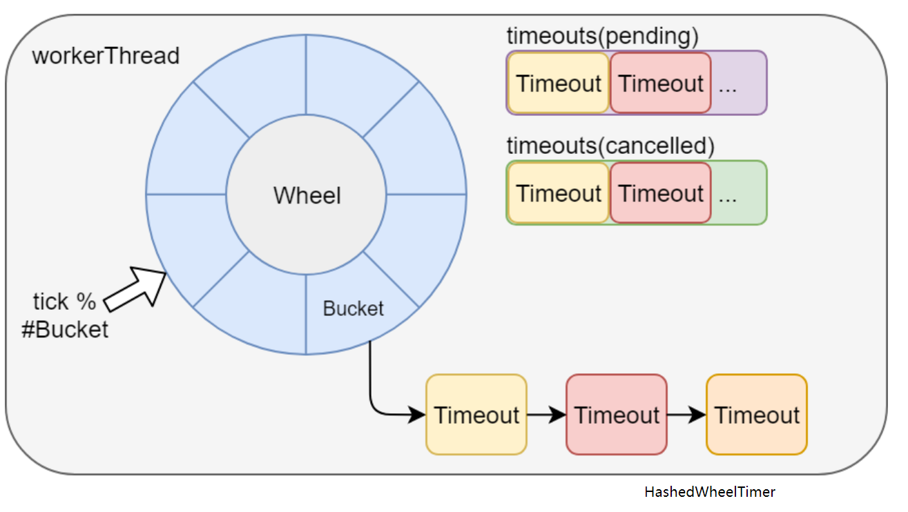

# 1. 缓存优化

> 当我们将nacos拿到的服务地址进行缓存之后，那么之后如果新添加机器，很明显，永远不会被访问到，这里，我们需要优化一下，实现一个定时任务，定时从nacos获取健康实例，添加到缓存中

## 1.1 Timer

> Timer是一种定时器工具，用来在一个后台线程计划执行指定任务。它可以安排任务“执行一次”或者定期“执行多次”。

**我们这里仍旧使用netty的Timer，前面我们在链路检测狗中已经初步使用**

netty中的HashedWheelTimer提供的是一个定时任务的一个优化实现方案，在netty中主要用于异步IO的定时规划触发（A timer optimized for approximated I/O timeout scheduling）。为了方便大家理解，可以先来看看这个图

- *workerThread* 单线程用于处理所有的定时任务，它会在每个tick执行一个bucket中所有的定时任务，以及一些其他的操作。意味着定时任务不能有较大的阻塞和耗时，不然就会影响定时任务执行的准时性和有效性。
- *wheel* 一个时间轮，其实就是一个环形数组，数组中的每个元素代表的就是未来的**某些时间**片段上需要执行的定时任务的集合。
  这里需要注意的就是不是某个时间而是某些时间。因为比方说我时间轮上的大小是10，时间间隔是1s，那么我1s和11s的要执行的定时任务都会在index为1的格子上。
- *tick* 工作线程当前运行的tick数，每一个tick代表worker线程当前的一次工作时间
- *hash* 在时间轮上的hash函数。默认是tick%bucket的数量，即将某个时间节点映射到了时间轮上的某个唯一的格子上。
- *bucket* 时间轮上的一个格子，它维护的是一个Timeout的双向链表，保存的是这个哈希到这个格子上的所有Timeout任务。
- *timeout* 代表一个定时任务，其中记录了自己的deadline，运行逻辑以及在bucket中需要呆满的圈数，比方说之前1s和11s的例子，他们对应的timeout中圈数就应该是0和1。 这样当遍历一个bucket中所有的timeout的时候，只要圈数为0说明就应该被执行，而其他情况就把圈数-1就好。

　　除此之外，netty的HashedWheelTimer实现还有两个东西值得关注，分别是*pending-timeouts*队列和*cancelled-timeouts*队列。这两个队列分别记录新添加的定时任务和要取消的定时任务，当*workerThread*每次循环运行时，它会先将*pending-timeouts*队列中一定数量的任务移动到它们对应的*bucket*，并取消掉*cancelled-timeouts*中所有的任务。由于添加和取消任务可以由任意线程发起，而相应的处理只会在*workerThread*里，所以为了进一步提高性能，这两个队列都是用了[JCTools](https://links.jianshu.com/go?to=%5Bhttps%3A%2F%2Fgithub.com%2FJCTools%2FJCTools%5D(https%3A%2F%2Fgithub.com%2FJCTools%2FJCTools))里面的MPSC(multiple-producer-single-consumer)队列。

## 1.2 实现

~~~java
package com.mszlu.rpc.netty.timer;

import com.alibaba.nacos.api.naming.pojo.Instance;
import com.mszlu.rpc.config.MsRpcConfig;
import com.mszlu.rpc.factory.SingletonFactory;
import com.mszlu.rpc.message.MsRequest;
import com.mszlu.rpc.register.nacos.NacosTemplate;
import io.netty.util.Timeout;
import io.netty.util.TimerTask;

import java.util.Set;
import java.util.concurrent.TimeUnit;

public class UpdateNacosServiceTask implements TimerTask {
    private NacosTemplate nacosTemplate;
    private MsRpcConfig msRpcConfig;
    private MsRequest msRequest;
    private Set<String> services;
    public UpdateNacosServiceTask(MsRequest msRequest, MsRpcConfig msRpcConfig, Set<String> services){
        this.services = services;
        this.msRequest = msRequest;
        this.msRpcConfig = msRpcConfig;
        this.nacosTemplate = SingletonFactory.getInstance(NacosTemplate.class);
    }

    @Override
    public void run(Timeout timeout) throws Exception {
        String serviceName = msRequest.getInterfaceName()+msRequest.getVersion();
        Instance oneHealthyInstance = nacosTemplate.getOneHealthyInstance(serviceName, msRpcConfig.getNacosGroup());
        services.add(oneHealthyInstance.getIp()+","+oneHealthyInstance.getPort());
        //执行完，继续任务
        timeout.timer().newTimeout(timeout.task(),10, TimeUnit.SECONDS);
    }
}

~~~

NettyClient中：

~~~java
 protected  HashedWheelTimer serviceTimer;

//发送请求的时候 触发 启动定时任务
            if (serviceTimer == null){
                serviceTimer = new HashedWheelTimer();
                serviceTimer.newTimeout(new UpdateNacosServiceTask(msRequest,msRpcConfig,SERVICES),10,TimeUnit.SECONDS);
            }
~~~

# 2. 负载均衡

> 放缓存的服务提供方地址多了后，需要提供负载均衡，将服务提供方的多个实例能合理的利用起来

## 2.1 随机算法

~~~java
package com.mszlu.rpc.balance;

import java.net.InetSocketAddress;
import java.util.Set;
//负载均衡器接口
public interface LoadBalance {

    String name();

    InetSocketAddress loadBalance(Set<String> services);
}

~~~

~~~java
package com.mszlu.rpc.balance;

import com.alibaba.nacos.common.utils.RandomUtils;
import lombok.extern.slf4j.Slf4j;

import java.net.InetSocketAddress;
import java.util.Optional;
import java.util.Set;
//随机算法的负载均衡实现类
@Slf4j
public class RandomLoadBalance implements LoadBalance {

    @Override
    public String name() {
        return "random";
    }

    @Override
    public InetSocketAddress loadBalance(Set<String> services) {
        if (services.size() <= 0){
            return null;
        }
        int nextInt = RandomUtils.nextInt(0, services.size() - 1);
        Optional<String> optional = services.stream().skip(nextInt).findFirst();
        if (optional.isPresent()){
            String ipAndPort = optional.get();
            String[] split = ipAndPort.split(",");
            log.info("应用了随机算法负载均衡器...");
            return new InetSocketAddress(split[0],Integer.parseInt(split[1]));
        }
        return null;
    }
}

~~~

## 2.2 SPI

~~~java
package com.mszlu.rpc.utils;

import com.mszlu.rpc.balance.LoadBalance;
import com.mszlu.rpc.exception.MsRpcException;

import java.util.ServiceLoader;

public class SPIUtils {

    public static LoadBalance loadBalance(String name) {
        ServiceLoader<LoadBalance> load = ServiceLoader.load(LoadBalance.class);
        for (LoadBalance loadBalance : load) {
            if (loadBalance.name().equals(name)) {
                return loadBalance;
            }
        }
        throw new MsRpcException("无对应的负载均衡器");
    }

}

~~~

在META-INF/services下新建com.mszlu.rpc.balance.LoadBalance文件

在其中写入

~~~properties
com.mszlu.rpc.balance.RandomLoadBalance
~~~

**运行测试**

## 2.2 轮询算法

~~~java
package com.mszlu.rpc.balance;

import com.alibaba.nacos.common.utils.RandomUtils;
import lombok.extern.slf4j.Slf4j;

import java.net.InetSocketAddress;
import java.util.ArrayList;
import java.util.List;
import java.util.Optional;
import java.util.Set;

@Slf4j
public class RoundRobinLoadBalance implements LoadBalance {

     Integer pos = 0;
     public RoundRobinLoadBalance(){
     }

    @Override
    public String name() {
        return "roundRobin";
    }

    @Override
    public InetSocketAddress loadBalance(Set<String> services) {
        if (services.size() <= 0){
            return null;
        }
        List<String> list = new ArrayList<>(services);
        System.out.println(pos+".....");
        synchronized (pos){
            if (pos >= services.size()){
                pos = 0;
            }
            String ipAndPort = list.get(pos);
            pos++;
            String[] split = ipAndPort.split(",");
            log.info("应用了轮询算法负载均衡器...");

            return new InetSocketAddress(split[0],Integer.parseInt(split[1]));
        }
    }
}

~~~

SPI配置：

~~~properties
com.mszlu.rpc.balance.RandomLoadBalance
com.mszlu.rpc.balance.RoundRobinLoadBalance
~~~

**因为轮询用到了成员变量，所以需要将其实例在加载的时候就确定下来，即只能有一个实例**

~~~java
 private final LoadBalance loadBalance;

    public NettyClient(){
        //
        this.loadBalance = SPIUtils.loadBalance("roundRobin");
    }
~~~

