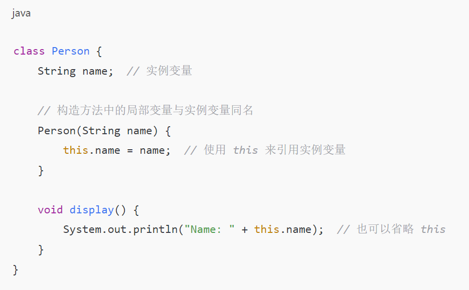
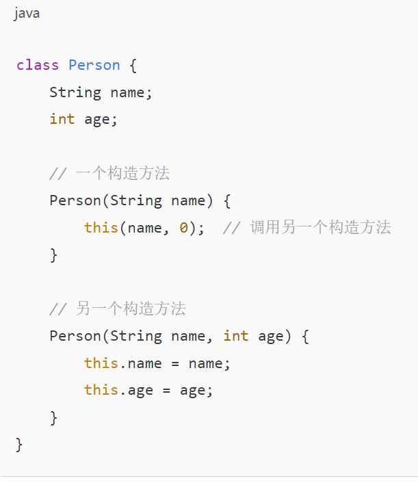
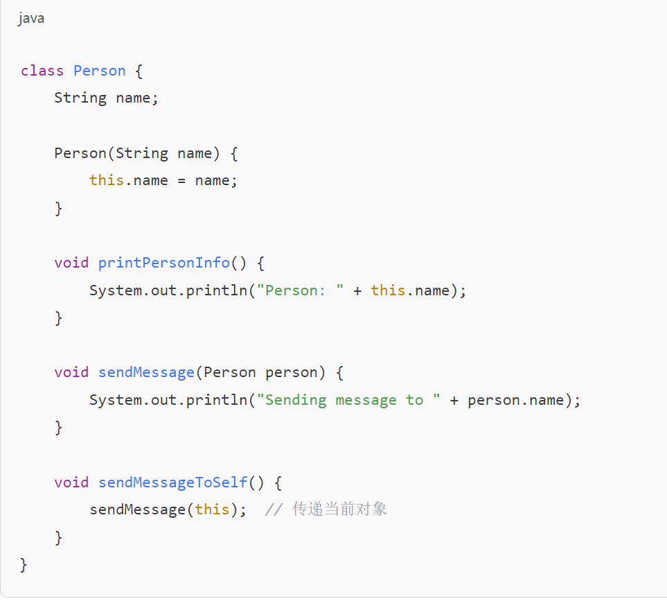

# 数组：必须初始化

​	动态初始化：int arr=new int[3]，仅指定数组长度

​	静态初始化：int[] arr = new int[]{1,2,3};仅指定初始值，系统指定长度

# 二维数组：

​	格式1

​		•数据类型[][] 变量名 = new 数据类型[m] [n];

​		•m表示这个二维数组有多少个一维数组

​		•n表示每一个一维数组的元素个数

​		•举例：

​		•int[][] arr = new int[3] [2];

​		•定义了一个二维数组arr

​		•这个二维数组有3个一维数组，名称是arr[0],arr[1],arr[2]

​		•每个一维数组有2个元素，可以通过arr[m] [n]来获取

​		•表示获取第m+1个一维数组的第n+1个元素

​	l格式2

​		•数据类型[][] 变量名 = new 数据类型[m][];

​		•m表示这个二维数组有多少个一维数组

​		•这一次没有直接给出一维数组的元素个数，可以动态的给出。

​		•举例：

​		•int[][] arr = new int[3][];

​		•arr[0] = new int[2];

​		•arr[1] = new int[3]

​		arr[2] = new int[1];

​	l格式3

​		•数据类型[][] 变量名 = new 数据类型[][]{{元素…},{元素…},{元素…}};

​		•简化版格式：

​		•数据类型[][] 变量名 = {{元素…},{元素…},{元素…}};

​		•举例：

​		•int[][] arr = {{1,2,3},{4,6},{6}};

# Java中的内存分配：

​	•栈 存储局部变量

​	•堆 存储new出来的东西

​	•方法区 (面向对象部分讲)

​	•本地方法区 (和系统相关)

​	寄存器 (给CPU使用)

# private:被修饰的成员只能在本类中访问

# 类的初始化过程：

​	Student s = new Student();在内存中做了哪些事情?

​		•加载Student.class文件进内存

​		•在栈内存为s开辟空间

​		•在堆内存为学生对象开辟空间

​		•对学生对象的成员变量进行默认初始化

​		•对学生对象的成员变量进行显示初始化

​		•通过构造方法对学生对象的成员变量赋值

​		•学生对象初始化完毕，把对象地址赋值给s变量

# 代码块

​	•在Java中，使用{}括起来的代码被称为代码块，根据其位置和声明的不同，可以分为局部代码块，构造代码块，静态代码块，同步代码块(多线程讲解)。

​	•局部代码块 

​		•在方法中出现；限定变量生命周期，及早释放，提高内存利用率

​	•构造代码块 

​		•在类中方法外出现；多个构造方法方法中相同的代码存放到一起，每次调用构造都执行，并且在构造方法前执行

​	•静态代码块 在类中方法外出现，加了static修饰

​		•在类中方法外出现，并加上static修饰；用于给类进行初始化，在加载的时候就执行，并且值执行一次。

# 继承

​	•通过extends关键字可以实现类与类的继承

​	•class 子类名 extends 父类名 {} 

​	一个类只能有一个父类

​	Java支持多层继承(继承体系)

​		•class A{}

​		•class B extends A{}

​		•class C extends B{}

​	

​	**不要为了部分功能而去继承**

# 重写

​	•子类中出现了和父类中一模一样的方法声明，也被称为方法覆盖，方法复写。

​	•使用特点：

​		•如果方法名不同，就调用对应的方法

​		•如果方法名相同，最终使用的是子类自己的

## 	方法重写的注意事项

​			•父类中私有方法不能被重写

​			•子类重写父类方法时，访问权限不能更低

​			•父类静态方法，子类也必须通过静态方法进行重写。(其实这个算不上方法重写，但是现象确实如此，至于为什么算不上方法重写，多态中我会讲解)

# 方法重写和方法重载的区别	

### 方法重写（Overriding）

方法重写是指子类重新定义父类中已经存在的方法。重写后的方法必须与父类中的方法具有相同的方法签名（即方法名、参数列表、返回类型必须一致），但方法的实现可以不同。重写发生在继承关系中，目的是让子类提供自己特定的实现。

**特点：**

1. **方法签名必须相同**：方法名、参数类型和参数个数都必须和父类的方法一致。

2. **返回类型一致**：返回类型必须与父类方法相同或是其子类型（协变返回类型）。

3. **访问权限**：子类重写的方法访问权限不能低于父类方法的访问权限（比如父类方法是 `public`，子类方法不能是 `private`）。

4. **运行时多态**：方法重写使得 Java 支持运行时多态，调用的是子类的重写方法

   例子：

   class Animal {
       void sound() {
           System.out.println("Animal makes a sound");
       }
   }

   class Dog extends Animal {
       @Override
       void sound() {
           System.out.println("Dog barks");
       }
   }

### 方法重载（Overloading）

   方法重载是指在同一个类中，方法名相同，但参数列表不同（参数的个数、类型或顺序不同）。方法重载发生在同一类中，目的是提供多种不同的方式来调用一个方法。

   **特点：**

   1. **方法名相同**：方法名必须相同。

   2. **参数列表必须不同**：参数的个数、类型或顺序必须不同。

   3. **返回类型可以不同**：方法重载不要求返回类型相同，但返回类型可以是不同的。

   4. **编译时多态**：方法重载使得编译器可以在编译阶段根据方法参数来决定调用哪个版本的方法。

  例子：

  class Animal {
      void sound() {
          System.out.println("Animal makes a sound");
      }
  }

  class Dog extends Animal {
      @Override
      void sound() {
          System.out.println("Dog barks");
      }
  }

  #### 方法重载能改变返回值类型吗？

  方法重载是根据方法的参数来区分不同的版本，因此可以改变返回值类型。但是，仅仅改变返回类型是不能构成重载的。换句话说，方法重载必须依赖于参数的不同，而不能仅通过返回类型的变化来实现重载。

# this关键字和super关键字分别代表什么?以及他们各自的使用场景和作用。

### `this` 关键字

`this` 关键字代表当前类的实例对象（即调用当前方法的对象）。它可以用于以下几种场景：

#### 1. **引用当前类的实例变量**

`this` 用于引用当前对象的实例变量，特别是在局部变量（如方法参数）与实例变量同名时，`this` 可以用来区分它们。

#### 2. **调用当前类的其他构造方法**

`this` 可以用于调用当前类的其他构造方法（构造方法重载）。这种调用必须是构造方法的第一行。

#### 3. **传递当前对象**

`this` 还可以作为参数传递给其他方法或构造方法，用于传递当前对象的引用。

