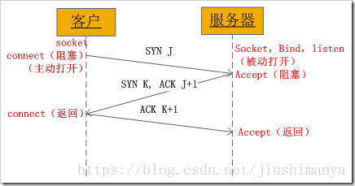
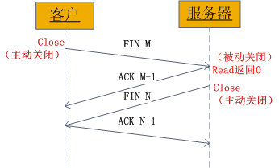

# TCP

功能：

1. 对应用层报文进行**分**段和重组；
2. 面向应用层实现**复**用与分解；
3. 实现端到端的**流**量控制；
4. **拥**塞控制；
5. 传输层**寻**址；
6. 对收到的报文进行**差错**检测（首部和数据部分都检错）；
7. 实现进程间的端到端**可靠**数据传输控制。

特点：

- TCP是面向连接的协议；
- TCP是面向字节流的协议；
- TCP的一个连接有两端，即点对点通信；
- TCP提供可靠的传输服务；
- TCP协议提供全双工通信（每条TCP连接只能一对一）；

### 可靠传输的基本原理

基本原理：

不可靠传输信道在数据传输中可能发生的情况：比特差错、乱序、重传、丢失
基于不可靠信道实现可靠数据传输采取的措施：
	差错检测：利用编码实现数据包传输过程中的比特差错检测
	确认：接收方向发送方反馈接收状态
	重传：发送方重新发送接收方没有正确接收的数据
	序号：确保数据按序提交
	计时器：解决数据丢失问题；
停止等待协议：是最简单的可靠传输协议，但是该协议对信道的利用率不高。
  连续ARQ(Automatic Repeat reQuest：自动重传请求)协议：滑动窗口+累计确认，大幅提高了信道的利用率。

#### TCP协议的可靠传输

基于连续ARQ协议，在某些情况下，重传的效率并不高，会**重复传输部分已经成功接收的字节**。

#### TCP协议的流量控制

**流量控制：让发送方发送速率不要太快**，TCP协议使用滑动窗口实现流量控制。

### TCP协议的拥塞控制

拥塞控制与流量控制的区别：流量控制考虑**点对点的通信量的控制**，而拥塞控制考虑**整个网络**，是全局性的考虑。拥塞控制的方法：**慢启动算法+拥塞避免算法**。

**慢开始和拥塞避免：**

1. 【**慢开始**】拥塞窗口从1指数增长；

2. 到达阈值时进入【**拥塞避免】**，变成+1增长；

3. **【超时】**，阈值变为当前cwnd的一半（不能<2）；

4. 再从【**慢开始**】，拥塞窗口从1指数增长。

   

**快重传和快恢复：**

1. 发送方连续收到**3个冗余ACK**，执行【**快重传**】，不必等计时器超时；
2. 执行【**快恢复**】，阈值变为当前cwnd的一半（不能<2），并从此**新的ssthresh**点进入【**拥塞避免】**。

### TCP连接的三次握手

**为什么需要三次握手？**

1. **第一次握手**：客户发送请求，此时服务器知道客户能发；
2. **第二次握手**：服务器发送确认，此时客户知道服务器能发能收；
3. **第三次握手**：客户发送确认，此时服务器知道客户能收

**建立连接（三次握手）：**

**第一次**：**客户向服务器发送连接请求段**，建立连接请求控制段（SYN=1），表示传输的报文段的第一个数据字节的序列号是x，此序列号代表整个报文段的序号（seq=x）；**客户端进入 SYN_SEND （同步发送状态）；**

第二次：服务器发回确认报文段，同意建立新连接的确认段（SYN=1），确认序号字段有效（ACK=1），服务器告诉客户端报文段序号是y（seq=y），表示服务器已经收到客户端序号为x的报文段，准备接受客户端序列号为x+1的报文段（ack_seq=x+1）；服务器由LISTEN进入SYN_RCVD （同步收到状态）;

**第三次**:**客户对服务器的同一连接进行确认**.确认序号字段有效(ACK=1),客户此次的报文段的序列号是x+1(seq=x+1),客户期望接受服务器序列号为y+1的报文段(ack_seq=y+1);**当客户发送ack时，客户端进入ESTABLISHED 状态;当服务收到客户发送的ack后，也进入ESTABLISHED状态;第三次握手可携带数据;**

**释放连接（四次挥手）**

**第一次：客户向服务器发送释放连接报文段，**发送端数据发送完毕，请求释放连接（FIN=1），传输的第一个数据字节的序号是x（seq=x）；**客户端状态由ESTABLISHED进入FIN_WAIT_1（终止等待1状态）；**

第二次：服务器向客户发送确认段，确认字号段有效（ACK=1），服务器传输的数据序号是y（seq=y），服务器期望接收客户数据序号为x+1（ack_seq=x+1）;**服务器状态由ESTABLISHED进入CLOSE_WAIT（关闭等待）； 客户端收到ACK段后，由FIN_WAIT_1进入FIN_WAIT_2；**

**第三次:服务器向客户发送释放连接报文段，**请求释放连接（FIN=1），确认字号段有效（ACK=1），表示服务器期望接收客户数据序号为x+1（ack_seq=x+1）;表示自己传输的第一个字节序号是y+1（seq=y+1）；服务器状态由CLOSE_WAIT 进入 LAST_ACK （最后确认状态）；

**第四次：客户向服务器发送确认段，**确认字号段有效（ACK=1），表示客户传输的数据序号是x+1（seq=x+1），表示客户期望接收服务器数据序号为y+1+1（ack_seq=y+1+1）；**客户端状态由FIN_WAIT_2进入TIME_WAIT，等待2MSL时间，进入CLOSED状态；服务器在收到最后一次ACK后，由LAST_ACK进入CLOSED；**

#### **为什么需要等待2MSL?**

1. 最后一个报文没有确认；
2. 确保发送方的ACK可以到达接收方；
3. 2MSL时间内没有收到，则接收方会重发；
4. 确保当前连接的所有报文都已经过期。

# HTTP

HTTP（HyperText Transfer Protocol:超文本传输协议）【TCP，端口80】：是可靠的数据传输协议，浏览器向服务器发收报文前，先建立TCP连接，HTTP使用TCP连接方式（HTTP自身无连接）。

HTTP请求报文方式：

GET：请求指定的页面信息，并返回实体主体；
POST：向指定资源提交数据进行处理请求；
DELETE：请求服务器删除指定的页面；
HEAD：请求读取URL标识的信息的首部，只返回报文头；
OPETION：请求一些选项的信息；
PUT：在指明的URL下存储一个文档。

