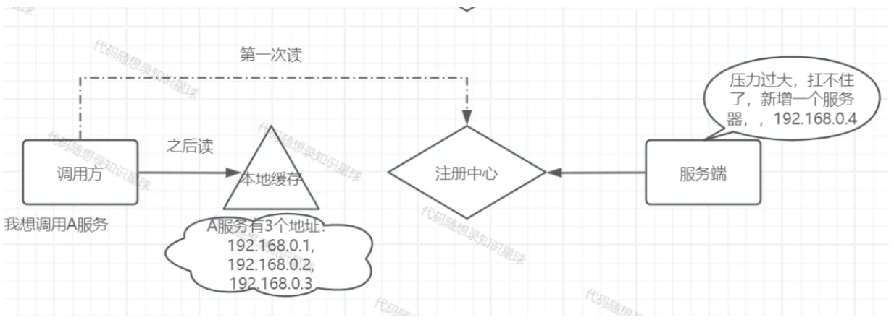
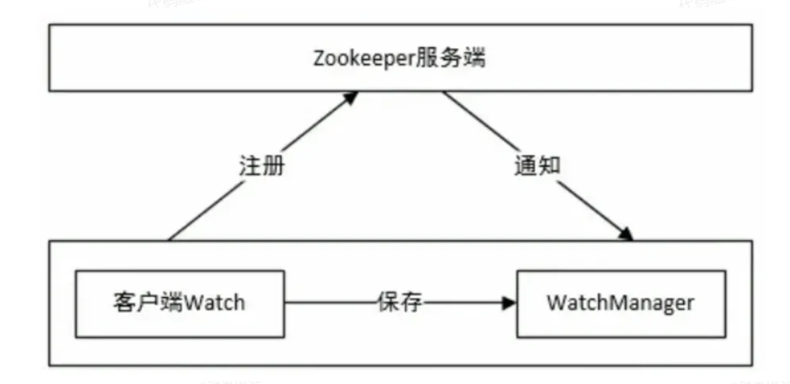
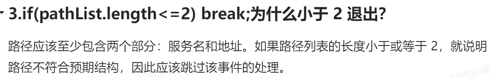
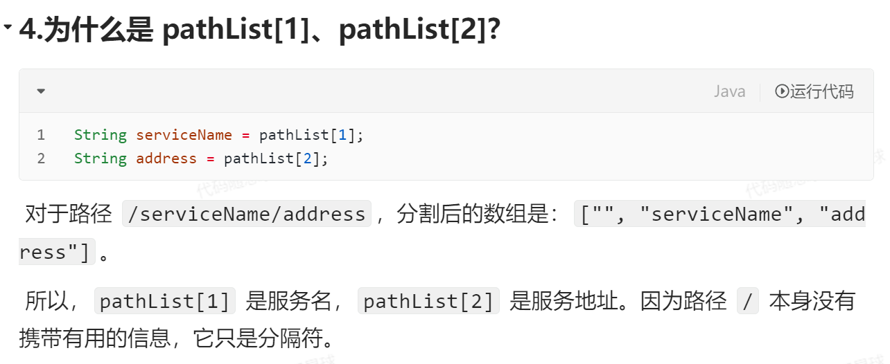

如果一个服务在注册中心中新增了一个地址，但是调用方始终能在本地缓存中读到这个服务
那么 新增的变化就永远无法感知到...那么问题来了，Server端新上一个服务地址，Client端的本地缓存该怎么才能感知到呢？

那么正解是:**通过在注册中心注册Watcher，监听注册中心的变化，实现本地缓存的动态更新**

# zkWatch

**CuratorCache 的作用和使用场景**

- **问题示例：** “为什么选择使用 CuratorCache 而不是 NodeCache 或 PathChildrenCache？它的优势在哪里？”
- **参考答案：**
  CuratorCache 是 Curator 框架中较新的一种缓存实现，提供了更高效和低延迟的事件监听机制。它可以监听节点及其子节点的变化，并且能够合并处理事件，适用于监控较大范围内的节点变化。

**监听器事件处理**

- **问题示例：** “请解释一下在 NODE_CHANGED 事件中是如何处理数据更新的，以及为何需要同时获取旧节点和新节点的数据？”
- **参考答案：**
  在 NODE_CHANGED 事件中，监听器获取修改前的节点数据（childData）和修改后的节点数据（childData1）。这样可以对比变化情况，进而调用缓存的 replaceServiceAddress 方法更新本地缓存。旧数据用于确定当前服务名称和地址，新数据则提供更新后的地址信息。

首先尝试从本地缓存中获取地址列表，如果缓存中不存在，再直接从 Zookeeper 获取（主要用于初始化阶段）