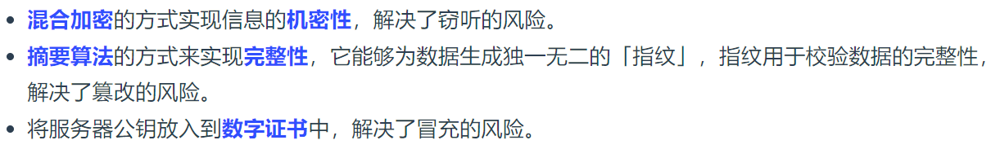

###  HTTP 与 HTTPS 有哪些区别？

### HTTPS 解决了 HTTP 的哪些问题？

#### HTTPS 是如何解决上面的三个风险的？

#### *1. 混合加密*

#### *2. 摘要算法 + 数字签名*

#### *3. 数字证书*

###  HTTPS 是如何建立连接的？其间交互了什么？

SSL/TLS 协议基本流程
	客户端向服务器索要并验证服务器的公钥。

​	双方协商生产「会话秘钥」

​	双方采用「会话秘钥」进行加密通信。

#### TLS 协议建立的详细流程：

##### *1. ClientHello*

##### *2. SeverHello*

##### *3.客户端回应*

##### *4. 服务器的最后回应*

#### 客户端校验数字证书的流程是怎样的？

###  HTTPS 的应用数据是如何保证完整性的？

### HTTPS 一定安全可靠吗？

