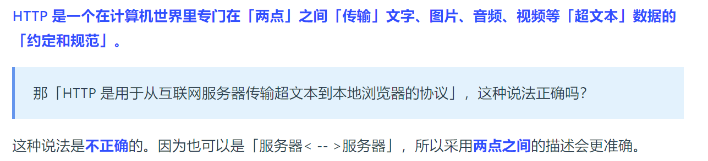
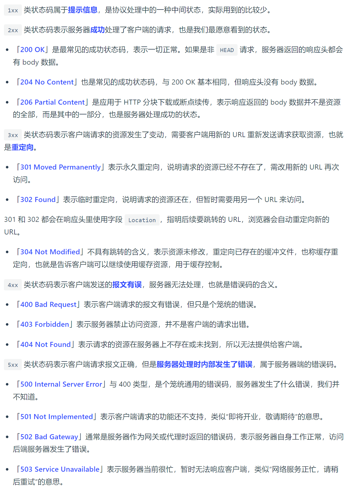
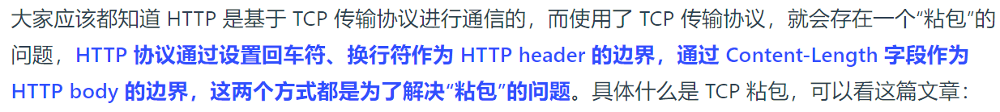

# HTTP是什么

超文本传输协议

# HTTP常见状态码

# HTTP常见字段有哪些

## *Host* 字段

## *Content-Length 字段*

服务器在返回数据时，会有 `Content-Length` 字段，表明本次回应的数据长度。

## *Connection 字段*

`Connection` 字段最常用于客户端要求服务器使用「HTTP 长连接」机制，以便其他请求复用。

HTTP 长连接的特点是，只要任意一端没有明确提出断开连接，则保持 TCP 连接状态。

## *Content-Type 字段*

`Content-Type` 字段用于服务器回应时，告诉客户端，本次数据是什么格式。

## *Content-Encoding 字段*

`Content-Encoding` 字段说明数据的压缩方法。表示服务器返回的数据使用了什么压缩格式

