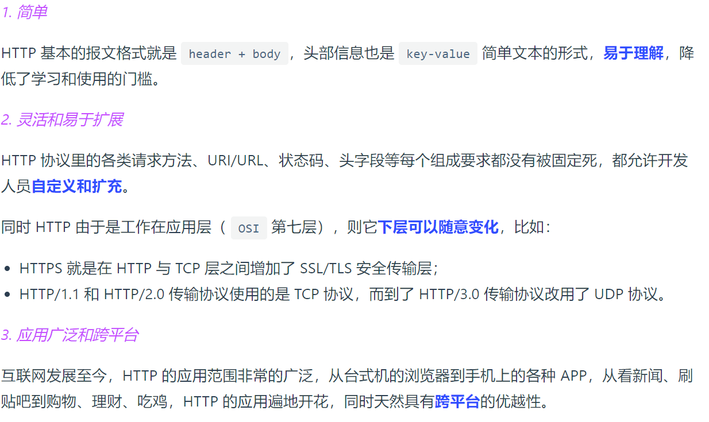
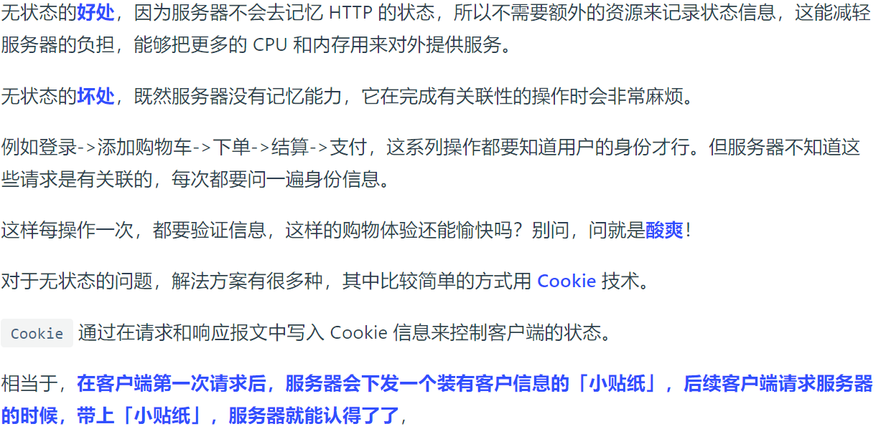
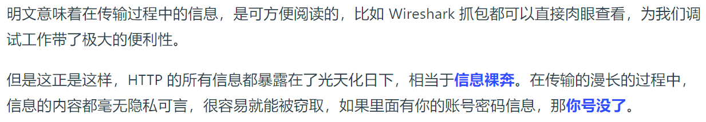
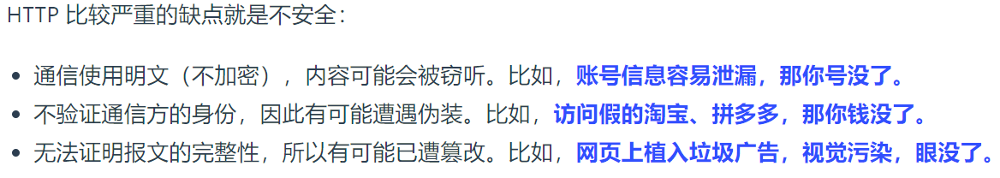
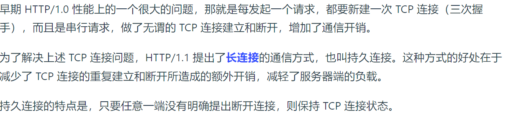
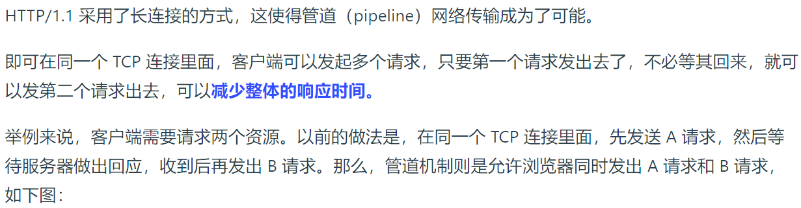
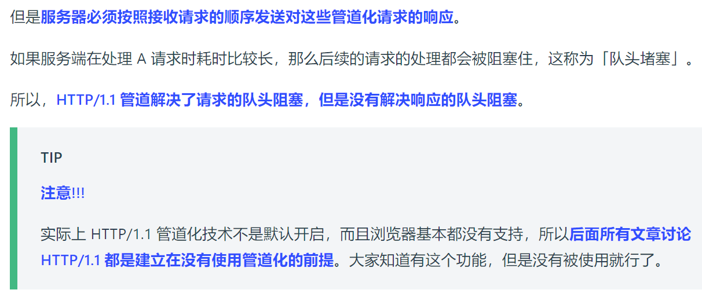

### HTTP/1.1 的优点有哪些？

### HTTP/1.1 的缺点有哪些？

#### *1. 无状态双刃剑*

#### *2. 明文传输双刃剑*

#### *3. 不安全*

HTTP 的安全问题，可以用 HTTPS 的方式解决，也就是通过引入 SSL/TLS 层，使得在安全上达到了极致

### HTTP/1.1 的性能如何？

HTTP 协议是基于 TCP/IP，并且使用了「请求-应答」的通信模式，所以性能的关键就在这两点里。

#### *1. 长连接*

#### *2. 管道网络传输*

#### *3. 队头阻塞*

