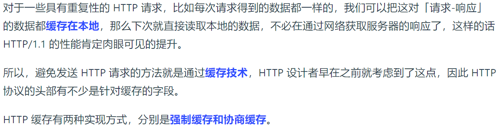
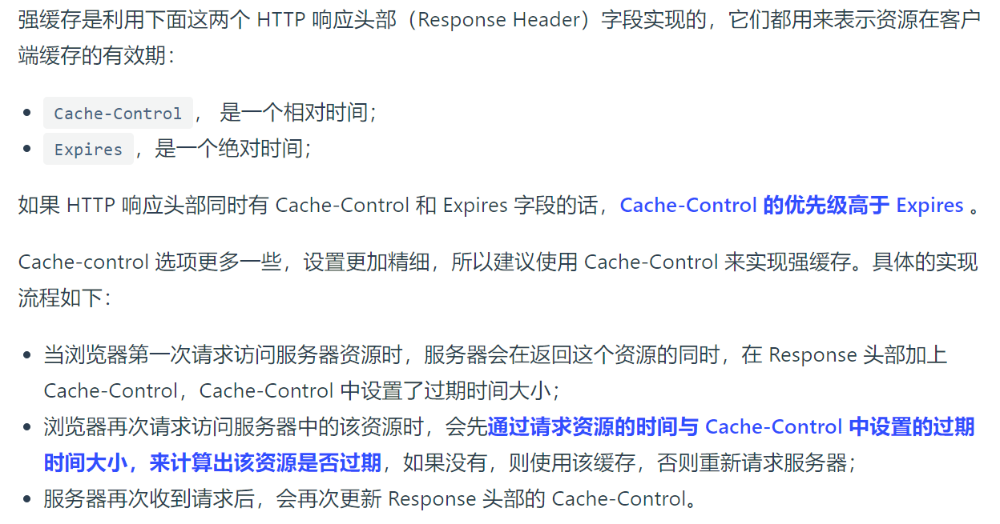
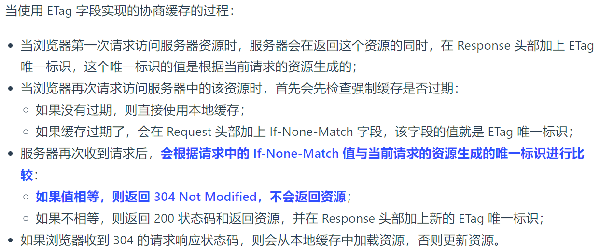

### HTTP 缓存有哪些实现方式？

### 什么是强制缓存？

强缓存指的是只要浏览器判断缓存没有过期，则直接使用浏览器的本地缓存，决定是否使用缓存的主动性在于浏览器这边。
如下图中，返回的是 200 状态码，但在 size 项中标识的是 from disk cache，就是使用了强制缓存。

###  什么是协商缓存？

当我们在浏览器使用开发者工具的时候，你可能会看到过某些请求的响应码是 304 ，这个是告诉浏览器可以使用本地缓存的资源，通常这种通过服务端告知客户端是否可以使用缓存的方式被称为协商缓存。

上图就是一个协商缓存的过程，所以协商缓存就是与服务端协商之后，通过协商结果来判断是否使用本地缓存。
协商缓存可以基于两种头部来实现。
**第一种**:请求头部中的 If-Modified-since字段与响应头部中的 Last-Modified 字段实现，这两个字段的意思是:
**响应头部中的 Last-Modified :**标示这个响应资源的最后修改时间,

**请求头部中的 If-Modified-since** :当资源过期了，发现响应头中具有 Last-Modified 声明，则再次发起请求的时候带上 Last-Modified 的时间，服务器收到请求后发现有 If-Modified-Since 则与被请求资源的最后修改时间进行对比(Last-Modified)，如果最后修改时间较新(大)，说明资源又被改过，则返回最新资源，HTTP 200 OK;如果最后修改时间较旧(小)，说明资源无新修改，响应 HTTP 304 走缓存。

**第二种**:请求头部中的 If-None-Match 字段与响应头部中的 ETag 字段，这两个字段的意思是:
**响应头部中 etag** :唯一标识响应资源
**请求头部中的 If-None-Match** :当资源过期时，浏览器发现响应头里有 Etag，则再次向服务器发起请求时，会将请求头 If-None-Match 值设置为 Etag 的值。服务器收到请求后进行比对，如果资源没有变化返回 304，如果资源变化了返回 200。

第一种实现方式是基于时间实现的，第二种实现方式是基于一个唯一标识实现的，相对来说后者可以更加准确地判断文件内容是否被修改，避免由于时间篡改导致的不可靠问题。

**为什么 ETag 的优先级更高?**这是因为 ETag 主要能解决 Last-Modified 几个比较难以解决的问题:

1、在没有修改文件内容情况下文件的最后修改时间可能也会改变，这会导致客户端认为这文件被改动了从而重新请求;

2、可能有些文件是在秒级以内修改的，If-Modified-since 能检查到的粒度是秒级的，使用 Etag就能够2保证这种需求下客户端在1秒内能刷新多次;

3、有些服务器不能精确获取文件的最后修改时间。

