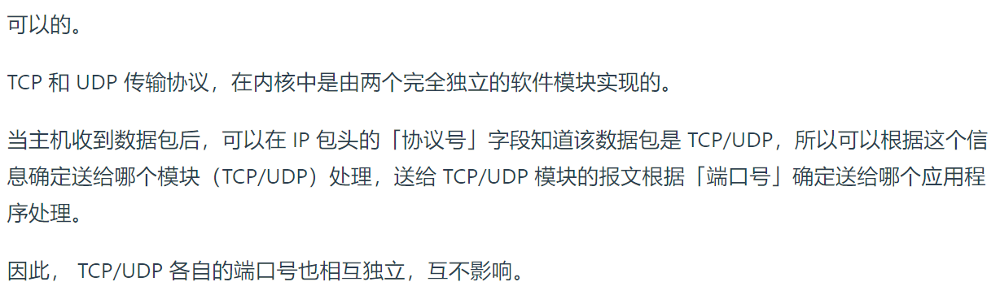
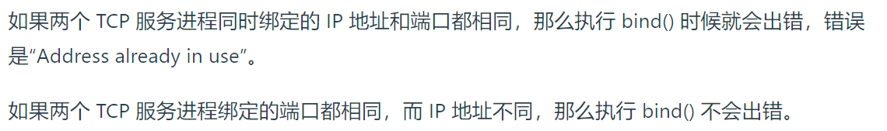
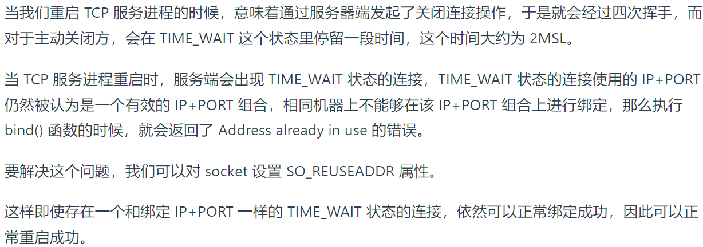
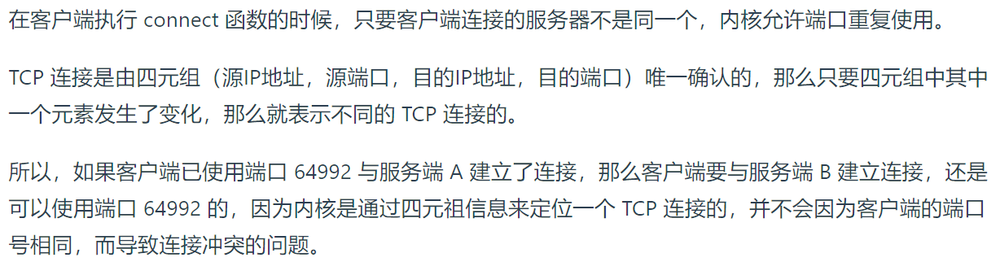
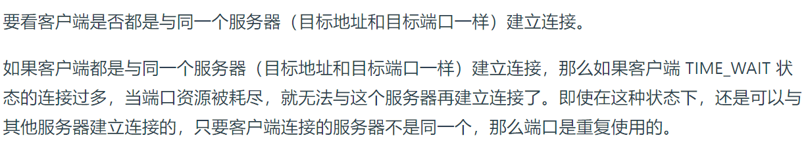
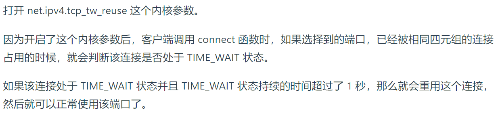

# TCP 和 UDP 可以同时绑定相同的端口吗？

# 多个 TCP 服务进程可以同时绑定同一个端口吗？

# 如何解决服务端重启时，报错“Address already in use”的问题？

# 客户端的端口可以重复使用吗？

# 客户端 TCP 连接 TIME_WAIT 状态过多，会导致端口资源耗尽而无法建立新的连接吗？

# 如何解决客户端 TCP 连接 TIME_WAIT 过多，导致无法与同一个服务器建立连接的问题？

