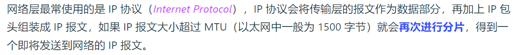
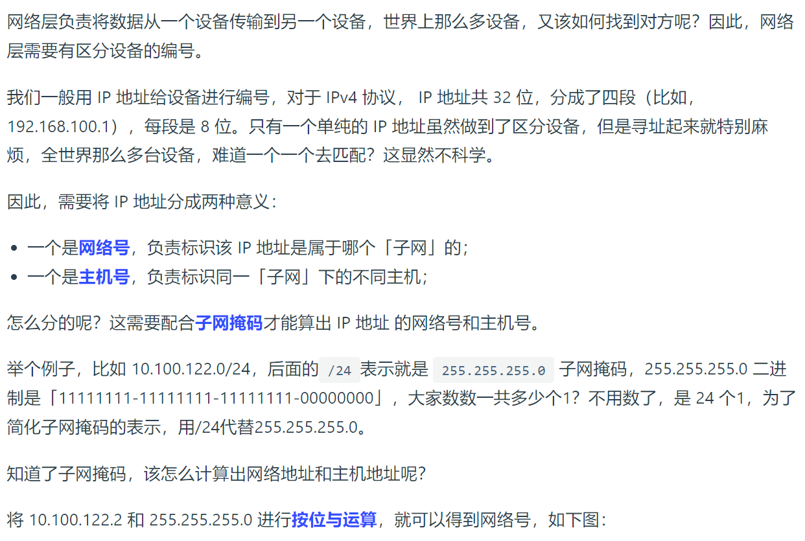

# TCP/IP 网络模型有哪几层？ 

 对于同一台设备上的进程间通信，有很多种方式，比如有管道、消息队列、共享内存、信号等方式，而对于不同设备上的进程间通信，就需要网络通信，而设备是多样性的，所以要兼容多种多样的设备，就协商出了一套通用的网络协议。 这个网络协议是分层的，每一层都有各自的作用和职责，接下来就根据「 TCP/IP 网络模型」分别对每一层进行介绍。

## 应用层

最上层的，也是我们能直接接触到的就是应用层(Application Layer)，我们电脑或手机使用的应用软件都是在应用层实现。那么，当两个不同设备的应用需要通信的时候，应用就把应用数据传给下一层，也就是传输层。
所以，应用层只需要专注于为用户提供应用功能，比如 HTTP、FTP、Telnet、DNS、SMTP等
应用层是不用去关心数据是如何传输的，就类似于，我们寄快递的时候，只需要把包裹交给快递员，由他负责运输快递，我们不需要关心快递是如何被运输的。
而且应用层是工作在操作系统中的用户态，传输层及以下则工作在内核态

## 传输层

应用层的数据包会传给传输层，传输层（Transport Layer）是为应用层提供网络支持的。

在传输层会有两个传输协议，分别是 TCP 和 UDP.

TCP 的全称叫传输控制协议(Transmission Control Protocol)，大部分应用使用的正是 TCP 传输层协议比如 HTTP 应用层协议。TCP 相比 UDP 多了很多特性，比如流量控制、超时重传、拥塞控制等，这些都是为了保证数据包能可靠地传输给对方。

UDP 相对来说就很简单，简单到只负责发送数据包，不保证数据包是否能抵达对方，但它实时性相对更好，传输效率也高。当然，UDP 也可以实现可靠传输，把TCP的特性在应用层上实现就可以，不过要实现一个商用的可靠 UDP 传输协议，也不是一件简单的事情。

应用需要传输的数据可能会非常大，如果直接传输就不好控制，因此当传输层的数据包大小超过 MSS(TCP最大报文段长度)，就要将数据包分块，这样即使中途有一个分块丢失或损坏了，只需要重新发送这一个分块，而不用重新发送整个数据包。在 TCP 协议中，我们把每个分块称为一个 TCP 段(TCPSegment)。

当设备作为接收方时，传输层则要负责把数据包传给应用，但是一台设备上可能会有很多应用在接收或者传输数据，因此需要用一个编号将应用区分开来，这个编号就是端口。
比如 80 端口通常是 Web 服务器用的，22 端口通常是远程登录服务器用的。而对于浏览器(客户端)中的每个标签栏都是一个独立的进程，操作系统会为这些进程分配临时的端口号。
由于传输层的报文中会携带端口号，因此接收方可以识别出该报文是发送给哪个应用。

## 网络层

传输层可能大家刚接触的时候，会认为它负责将数据从一个设备传输到另一个设备，事实上它并不负责

实际场景中的网络环节是错综复杂的，中间有各种各样的线路和分叉路口，如果一个设备的数据要传输给另一个设备，就需要在各种各样的路径和节点进行选择，而传输层的设计理念是简单、高效、专注，如果传输层还负责这一块功能就有点违背设计原则了，

也就是说，我们不希望传输层协议处理太多的事情，只需要服务好应用即可，让其作为应用间数据传输的媒介，帮助实现应用到应用的通信，而实际的传输功能就交给下一层，也就是网络层(internet Layer)

所以，**IP 协议的寻址作用是告诉我们去往下一个目的地该朝哪个方向走，路由则是根据「下一个目的地」选择路径。寻址更像在导航，路由更像在操作方向盘。**

## 网络接口层

生成了 IP 头部之后，接下来要交给网络接口层(Link Layer)在 IP 头部的前面加上 MAC 头部，并封装成数据帧(Data frame)发送到网络上。

IP 头部中的接收方 IP 地址表示网络包的目的地，通过这个地址我们就可以判断要将包发到哪里，但在以太网的世界中，这个思路是行不通的。

什么是以太网呢?电脑上的以太网接口，Wi-Fi接口，以太网交换机、路由器上的千兆，万兆以太网口还有网线，它们都是以太网的组成部分。以太网就是一种在「局域网」内，把附近的设备连接起来，使它们之间可以进行通讯的技术。

以太网在判断网络包目的地时和 IP 的方式不同，因此必须采用相匹配的方式才能在以太网中将包发往目的地，而 MAC头部就是干这个用的，所以，在以太网进行通讯要用到 MAC 地址。

MAC头部是以太网使用的头部，它包含了接收方和发送方的 MAC 地址等信息，我们可以通过 ARP 协议获取对方的 MAC 地址。

所以说，网络接口层主要为网络层提供「链路级别」传输的服务，负责在以太网、WiFi 这样的底层网络上发送原始数据包，工作在网卡这个层次，使用 MAC 地址来标识网络上的设备。

